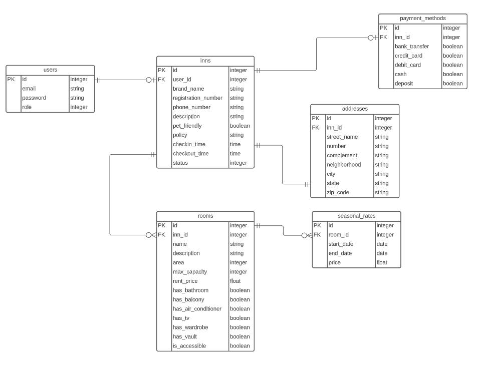

# POUSADARIA

Este é um projeto desenvolvido durante meus estudos no programa TreinaDev, turma 11, de uma aplicação de aluguel de quartos em pousadas.

## Sprints de desenvolvimento
### Primeiro sprint
* Criar conta como dono de pousada
* Cadastrar pousada
* Adicionar quartos
* Preços por período

## Modelos
### User: 
Modelo responsável pela gestão das informações dos usuários da aplicação, autenticação e autorização. A Gem Devise foi empregada no projeto para as necessidades de autenticação e autorização. 

  * `email`: string para armazenar o e-mail do usuário;
  * `password`: campo automático do Devise para armazenar a senha do usuário;
  * `role`: inteiro usado como enum para classificar o usuário como `regular` ou `host`;

### Inn: 
Modelo para gestão das informações de pousada. Cada usuário pode possuir até uma pousada, e o usuário precisa ter o atributo `role` com o valor `host` para ter autorização de acesso às rotas de criação de uma pousada.

  * `user_id`: chave estrangeira que relaciona com o modelo `User`;
  * `brand_name`: string com o nome da pousada;
  * `registration_number`: string para armazenar o CNPJ da pousada;
  * `phone_number`: string para armazenar o telefone de contato da pousada;
  * `pet_friendly`: booleano para identificar se a pousada aceita ou não animais de estimação;
  * `policy`: string para o anfitrião adicionar as políticas de sua pousada;
  * `checkin_time`: horário no formato `time` para o _check-in_ dos hóspedes;
  * `checkout_time`: horário no formato `time` para o _check-out_ dos hóspedes;
  * `status`: inteiro usado como enum para classificar a pousada como `active` ou `inactive`;

### Address: 
Modelo responsável por armazenar as informações do endereço da pousada cadastrada. A escolha do endereço ter seu próprio modelo é pensando em viabilizar a alimentação de dados via API externa no futuro, caso algo semelhante seja proposto. Este modelo é criado através do mesmo formulário usado para criação da pousada.

  * `inn_id`: chave estrangeira que relaciona com o modelo `Inn`;
  * `street_name`: string com o logradouro do endereço;
  * `number`: string com o número do endereço, que pode conter letras (ex: 105B);
  * `complement`: string com o complemento do endereço (ex: apto 42, bloco A);
  * `neighborhood`: string com o bairro do endereço;
  * `city`: string com a cidade do endereço;
  * `state`: string com a sigla do estado do endereço;
  * `zip_code`: string com o código postal (CEP) do endereço;

### PaymentMethod:
Modelo responsável por armazenar os meios de pagamento que uma pousada aceita. Este modelo é criado através do mesmo formulário usado para criação da pousada.

  * `inn_id`: chave estrangeira que relaciona com o modelo `Inn`;
  * `bank_transfer`: boolean indicando se a pousada aceita pagamento via PIX; 
  * `credit_card`: boolean indicando se a pousada aceita pagamento via cartão de crédito;
  * `debit_card`: boolean indicando se a pousada aceita pagamento via cartão de débito;
  * `cash`: boolean indicando se a pousada aceita pagamento em dinheiro;
  * `deposit`: boolean indicando se a pousada aceita pagamento via depósito bancário;

### Room:
Modelo que armazena as informações do quarto de uma pousada. Esse modelo será responsável, no futuro, por calcular o valor de uma reserva e verificar sua disponibilidade de datas, através de suas associações.  

  * `inn_id`: chave estrangeira que relaciona com o modelo `Inn`;
  * `name`: string com o nome do quarto;
  * `description`: string com uma breve descrição do quarto;
  * `area`: inteiro indicando quantos metros quadrados de área o quarto possui;
  * `max_capacity`: inteiro que indica a capacidade máxima de pessoas no quarto;
  * `rent_price`: float que indica o preço de uma diária do quarto, em reais brasileiros (BRL);
  * `status`: inteiro usado como enum para classificar o quarto como `active` ou `inactive`;
  * `has_bathroom`: boolean indicando se o quarto possui banheiro privativo;
  * `has_balcony`: boolean indicando se o quarto possui varanda;
  * `has_air_conditioner`: boolean indicando se o quarto possui ar condicionado;
  * `has_tv`: boolean indicando se o quarto possui televisão;
  * `has_wardrobe`: boolean indicando se o quarto possui guarda-roupas;
  * `has_vault`: boolean indicando se o quarto possui cofre;
  * `is_accessible`: boolean indicando se o quarto é acessível para PCDs;

### SeasonalRate
Modelo para o anfitrião armazenar informações sobre preços de alta e baixa temporada, ou eventuais preços promocionais em períodos estratégicos para melhorar suas vendas. Não é possível existir duas taxas sazonais ao mesmo tempo.

  * `room_id`: chave estrangeira que relaciona com o modelo `Room`;
  * `start_date`: data de início do preço diferenciado;
  * `end_date`: data de término do preço diferenciado;
  * `price`: preço a ser praticado no determinado período;

## Banco de Dados

